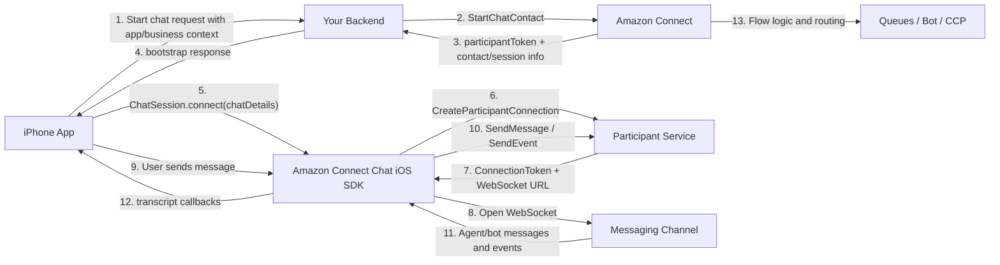

# ConnectFloatingChatDemo

Native iOS POC for a floating support chat experience using the Amazon Connect Chat iOS SDK binaries.

This repository now ships both:

- a **mock conversation UI** for fast local UX evaluation
- a **real Amazon Connect path** that calls a local backend API, which then calls `StartChatContact`

The Amazon Connect frameworks are embedded in the iOS project, and the repo now includes a minimal backend service in `backend/`.

## Project Goal

This POC is meant to answer these product and engineering questions:

- Can we show a floating chat bubble above both SwiftUI and UIKit screens?
- Can we expand that bubble into a chat panel without coupling it to a single view hierarchy?
- Is Amazon Connect a feasible backend for a native iPhone chat experience?
- Where should app-specific business data be sent when starting a chat?

## Current State Of The Repo

What is implemented now:

- Floating bubble overlay hosted in the main app view hierarchy
- Chat panel rendered in SwiftUI
- Demo entry points from both SwiftUI and UIKit screens
- Mock transcript with fake agent replies for UX evaluation
- Amazon Connect binary frameworks already embedded into the Xcode project
- Local backend bootstrap API for real `StartChatContact`
- Real iOS SDK provider wired to the backend bootstrap response

What is not implemented yet:

- Your AWS credentials and Amazon Connect resource values
- Live transcript verification against your own Amazon Connect instance
- Production auth, rate limiting, and secret management for the backend

## Included Frameworks

- `AmazonConnectChatIOS.xcframework` version `2.0.12`
- `AWSCore.xcframework` version `2.41.0`
- `AWSConnectParticipant.xcframework` version `2.41.0`

## Open And Run

### Mock Mode

1. Open `ConnectFloatingChatDemo.xcodeproj` in Xcode.
2. Select your Apple signing team.
3. Build and run on an iOS simulator or device.
4. Open the `POC` tab.
5. Use the inline chat or `Open Chat Panel`.

### Real Amazon Connect Mode

1. In `backend/`, copy `.env.example` to `.env`.
2. Fill your AWS credential source and Amazon Connect values.
3. Run:

```bash
cd backend
npm install
npm run dev
```

4. In the iOS app, switch provider to `Amazon Connect`.
5. Confirm the bootstrap endpoint is `http://127.0.0.1:8787/api/chat/start`.
6. Fill your real `Instance ID`, `Contact Flow ID`, and `Region` if they are not already in `.env`.
7. Tap `Connect Real SDK`.

## POC Walkthrough

The app supports three demo surfaces:

- `POC` tab: direct controls to start the mock chat or open the panel
- `SwiftUI` tab: demo host screen in SwiftUI
- `UIKit` tab: demo host screen in UIKit

The floating widget behavior is the important part of this POC:

- tapping `Show Floating Bubble` places a bubble above the whole app
- tapping the bubble opens the chat panel
- the panel is not tied to one view controller or one SwiftUI screen
- the overlay now lives in the same app hierarchy as the main content so the chat input behaves consistently

## Folder Structure

```text
ConnectFloatingChatDemo/
├── ConnectFloatingChatDemo.xcodeproj
├── ConnectFloatingChatDemo/
│   ├── ConnectFloatingChatDemoApp.swift
│   ├── Models/
│   ├── Services/
│   ├── Supporting/
│   ├── UIKit/
│   └── Views/
├── backend/
│   ├── .env.example
│   ├── package.json
│   └── server.mjs
├── Vendor/
│   ├── AmazonConnectChatIOS.xcframework
│   ├── AWSCore.xcframework
│   └── AWSConnectParticipant.xcframework
└── README.md
```

## What The Amazon Connect iPhone SDK Actually Does

The Amazon Connect Chat iOS SDK is **not** your full chat backend.

Think of it as a native client session layer that mainly handles:

- participant connection setup
- WebSocket connection management
- transcript receive/update callbacks
- sending chat messages
- sending chat events like typing and receipts
- reconnect behavior
- attachment-related operations

It does **not** by itself:

- start the business chat on your behalf
- know who your customer is
- pull data from your app or CRM automatically
- choose what business metadata to send
- replace your backend

In a real architecture, your backend is still responsible for creating the chat with Amazon Connect.

## Local Backend API

The backend included in this repo exposes:

- `GET /health`
- `POST /api/chat/start`

Expected request body from the iOS app:

```json
{
  "customerName": "Taylor",
  "customerId": "CUST-1024",
  "orderId": "ORD-9981",
  "membershipTier": "Gold",
  "locale": "en-US",
  "issueType": "delivery_status",
  "region": "us-east-1",
  "instanceId": "your-connect-instance-id",
  "contactFlowId": "your-contact-flow-id"
}
```

Response shape returned to the iOS app:

```json
{
  "participantToken": "token-from-start-chat-contact",
  "participantId": "participant-id",
  "contactId": "contact-id",
  "region": "us-east-1"
}
```

The iOS app already understands that response shape through `NetworkChatSessionBootstrapProvider`.

## Real Integration Architecture



## End-To-End Data Flow

### 1. App collects context

Your app knows things like:

- customer ID
- account ID
- order ID
- membership tier
- locale
- app version
- screen or journey context

### 2. App calls your backend

Your mobile app should send only the business context your backend needs to start a chat.

Example:

```json
{
  "customerId": "12345",
  "orderId": "ORD-9981",
  "membershipTier": "Gold",
  "locale": "en-US",
  "appVersion": "3.4.2",
  "issueType": "delivery_status"
}
```

### 3. Backend calls `StartChatContact`

Your backend maps that app data into Amazon Connect request fields such as:

- `ParticipantDetails.DisplayName`
- `Attributes`
- `SegmentAttributes`
- `InitialMessage`

Example backend request to Amazon Connect:

```json
{
  "InstanceId": "connect-instance-id",
  "ContactFlowId": "contact-flow-id",
  "ParticipantDetails": {
    "DisplayName": "Shravan"
  },
  "Attributes": {
    "customerId": "12345",
    "orderId": "ORD-9981",
    "membershipTier": "Gold",
    "locale": "en-US",
    "appVersion": "3.4.2",
    "platform": "iOS"
  },
  "InitialMessage": {
    "ContentType": "text/plain",
    "Content": "I need help with my order."
  }
}
```

### 4. Amazon Connect returns chat bootstrap values

Typical values returned:

- `participantToken`
- `contactId`
- `participantId`

### 5. Backend returns only the needed bootstrap payload to the app

The app should not need broad AWS credentials. It should typically receive only the chat bootstrap details.

### 6. App connects through the SDK

Real integration would look like:

```swift
let chatDetails = ChatDetails(
    contactId: response.contactId,
    participantId: response.participantId,
    participantToken: response.participantToken
)

ChatSession.shared.connect(chatDetails: chatDetails) { result in
    // handle success or failure
}
```

### 7. SDK creates participant connection

Under the hood, the SDK uses the participant data to obtain:

- a participant connection
- a connection token
- a WebSocket URL

### 8. SDK opens and manages the WebSocket

This is where the SDK adds real value:

- socket setup
- subscription
- reconnect handling
- transcript callbacks

### 9. Your UI sends messages through the SDK

Example:

```swift
chatSession.sendMessage(contentType: .plainText, message: "Where is my order?") { result in
    // handle send result
}
```

### 10. Agent and bot responses come back through the SDK

Your UI listens to events such as:

- `onTranscriptUpdated`
- `onMessageReceived`
- `onTyping`
- `onReadReceipt`
- `onDeliveredReceipt`

## Where App-Specific Data Should Go

This is the most important design point.

### Good place: `StartChatContact.Attributes`

Use this for stable business metadata that should be available to:

- contact flows
- routing logic
- agents
- reporting or downstream integrations

Examples:

- `customerId`
- `accountNumber`
- `membershipTier`
- `orderId`
- `productLine`
- `locale`
- `platform`
- `appVersion`

### Good place: `InitialMessage`

Use this for the first visible user message if you want the transcript to begin with a meaningful prompt.

Examples:

- "I need help with my delivery"
- "I want to update my address"

### Good place: normal `SendMessage`

Use this for regular conversation text after the session is connected.

Examples:

- user chat text
- bot visible replies
- free-form support messages

### Good place: `SendEvent`

Use this for protocol-style chat events, not business metadata.

Examples:

- typing indicators
- delivery receipts
- read receipts

### Usually not a good place: hidden app context inside chat text

Do not hide important metadata in visible messages if it should really be structured routing data.

Bad example:

```text
CUSTOMER_ID=12345 ORDER_ID=9981 HELP ME
```

That should instead go into `Attributes`.

## What The SDK Does Not Automatically Send

The SDK does **not** automatically inspect your app and send:

- your logged-in user object
- your database records
- screen state
- local model objects
- private device state
- internal app analytics data

If Amazon Connect should know something, **your code must explicitly send it**.

## Security Model

Recommended model:

- mobile app authenticates with your backend
- your backend calls `StartChatContact`
- backend returns only the session bootstrap values needed by the app
- mobile app uses those values with the chat SDK

This keeps the trust boundary cleaner than giving the app overly broad AWS access.

## How Agents See The Data

The business metadata you send through `StartChatContact.Attributes` can be used for:

- flow branching
- queue routing
- personalized welcome logic
- agent context in the CCP

That is why `Attributes` are the main integration point for app-specific business information.

## What This POC Proves

This repository already proves:

- the floating chat bubble pattern is feasible on iPhone
- the panel can live above both SwiftUI and UIKit
- the UI can be validated before backend work is complete
- Amazon Connect binaries can be bundled into a native Xcode app

This repository does **not yet** prove:

- final routing behavior
- final auth model
- real transcript and event flow from Amazon Connect
- production readiness of reconnects, attachments, or analytics

## Recommended Next Step For The Team

### Phase 1: keep this repo for UX review

Use the current mock mode for:

- product review
- layout review
- overlay behavior review
- PM/design sign-off

### Phase 2: add a real backend contract

Build one small backend endpoint, for example:

`POST /api/chat/start`

Request:

```json
{
  "customerId": "12345",
  "orderId": "ORD-9981",
  "membershipTier": "Gold",
  "locale": "en-US"
}
```

Response:

```json
{
  "participantToken": "token",
  "participantId": "participant-id",
  "contactId": "contact-id"
}
```

### Phase 3: swap the mock service with live `ChatSession`

At that point, keep the UI but replace the mock transcript engine with:

- backend bootstrap call
- `ChatSession.connect`
- real callbacks
- real `sendMessage`

## Important Notes

- This repo currently uses mock transcript data only.
- The Amazon Connect frameworks are still embedded for feasibility review.
- The bundled `AmazonConnectChatIOS.xcframework` needed a local Swift interface compatibility patch to build on Xcode `26.3` in this workspace.

## GitHub Repo

This repository is intended to be cloned on other Macs for continued development:

- current remote: `https://github.com/shravangudikadi/ChatApp.git`
